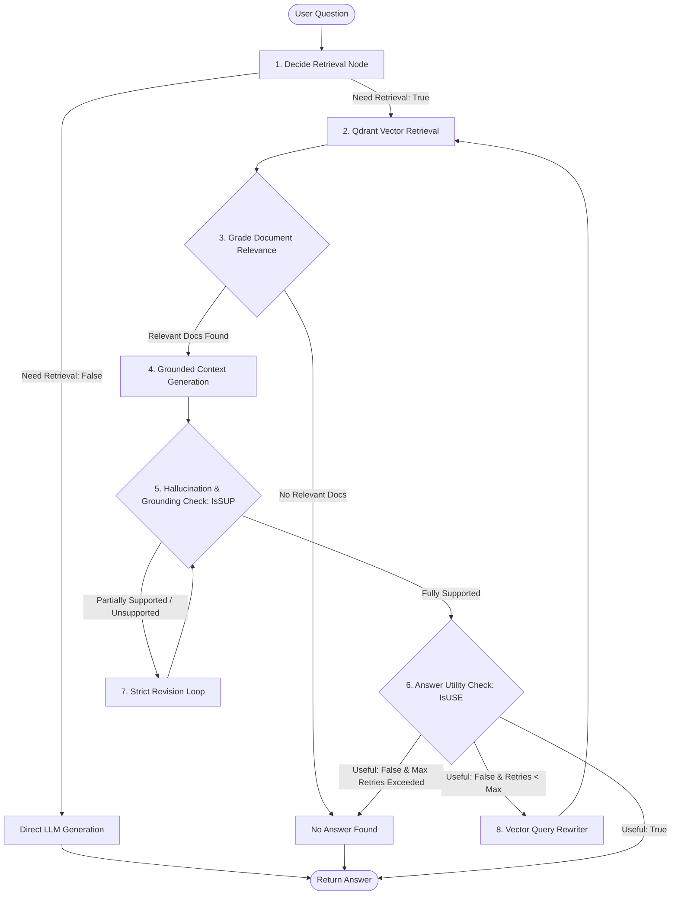

# Self-RAG: Self-Reflective Retrieval-Augmented Generation

An advanced, self-corrective Retrieval-Augmented Generation (RAG) system built with **LangGraph**, **Qdrant Vector Database**, and structured LLM verification nodes. It dynamically evaluates retrieval necessity, grades document relevance, verifies groundedness against factual evidence, initiates self-correction loops, and iteratively rewrites queries.

---

## System Architecture



---

## Key Features

- **Adaptive Retrieval Gating (`decide_retrieval_node`):** Classifies incoming queries via structured Pydantic output (`RetrieveDecision`) to bypass vector retrieval for general questions and trigger retrieval only for domain-specific queries.
- **Topical Document Grading (`is_relevant_node`):** Evaluates retrieved document chunks from Qdrant at the topic level to strip out distractor documents before context synthesis.
- **Strict Hallucination Verification (`is_supported_node`):** Uses an `IsSUPDecision` evaluator to check whether claims are strictly grounded in context, extracting verbatim evidence quotes.
- **Iterative Self-Correction (`revise_answer_node`):** Re-writes answers using strict, quote-grounded formatting when unsupported claims or interpretations are detected.
- **Query Rewriting & Retry Feedback Loop (`rewrite_question_node`):** Rewrites vague user prompts into high-signal vector search queries with automated retry backoff when answers fail utility checks (`IsUSEDecision`).

---

## Tech Stack

- **Orchestration:** LangGraph (`StateGraph`, conditional edges, state channels)
- **Vector Database:** Qdrant (`QdrantClient`, `QdrantVectorStore`)
- **Embeddings & LLMs:** HuggingFace (`BAAI/bge-small-en-v1.5`, `Llama-3.1-8B-Instruct`), Groq (`Llama-3.3-70B`), Google Gemini (`gemini-2.5-flash`)
- **Document Processing:** LangChain Community PyPDFLoader, RecursiveCharacterTextSplitter
- **Data Validation:** Pydantic v2

---

## State Schema

```python
class SelfState(TypedDict):
    question: str
    retrieval_query: str
    rewrite_tries: int
    need_retrieval: bool
    docs: List[Document]
    relevant_docs: List[Document]
    context: str
    answer: str
    issup: Literal["fully_supported", "partially_supported", "no_support"]
    evidence: List[str]
    retries: int
    isuse: Literal["useful", "not_useful"]
    use_reason: str
```

---

## Getting Started

### 1. Prerequisites
- Python 3.10+
- [uv](https://docs.astral.sh/uv/) (recommended) or `pip`

### 2. Installation

```bash
git clone https://github.com/Ayyan119/Self-RAG-Architecture.git
cd Self-RAG-Architecture

# Using uv
uv sync

# Or using standard venv
python3 -m venv .venv
source .venv/bin/activate
pip install -r requirements.txt
```

### 3. Environment Setup

Create a `.env` file with your API keys:

```env
GROQ_API_KEY=your_groq_api_key
GOOGLE_API_KEY=your_google_api_key
HUGGINGFACEHUB_API_TOKEN=your_hf_token
```

### 4. Running the Workflow

Explore the complete compiled state graph inside `notebooks/1_Self_RAG.ipynb` or run the module:

```bash
jupyter notebook notebooks/1_Self_RAG.ipynb
```

---

## Repository Structure

```text
Self-RAG-Architecture/
├── notebooks/
│   └── 1_Self_RAG.ipynb    # End-to-end LangGraph Self-RAG implementation & traces
├── src/
│   └── self_rag/           # Package initialization
├── pyproject.toml          # Project configuration & dependencies
├── requirements.txt        # Production dependency lock
└── uv.lock                 # Deterministic lockfile
```

---

## License

MIT License.
